# Test Execution Report

## Execution Summary

The implemented automated tests are located under `tests/` and `backend/tests/unit/`. The current repository evidence supports Playwright for API/UI checks, Vitest for backend unit testing, and k6 for performance scripts under `tests/performance/`.

The latest available Playwright run metadata in `frontend/test-results/.last-run.json` shows:

- Status: `passed`
- Failed tests: `[]`

This report records the current implemented Playwright test set as passing in the latest available run metadata. For backend unit testing and k6, this report includes only the execution evidence that is currently available in the repository and does not claim results beyond that evidence.

## Playwright Execution

Playwright is configured in `frontend/playwright.config.ts`:

- Test directory: `../tests`
- Timeout: 30 seconds
- Workers: `1`
- Headless mode: enabled
- Reporters: list and HTML report

The test suite currently runs reliably with Playwright workers set to `1`.

Command used from the frontend project:

```bash
cd frontend
npm run test:e2e
```

Equivalent direct command:

```bash
cd frontend
node ./node_modules/@playwright/test/cli.js test
```

The application services must be running locally before executing these tests:

```bash
cd backend
npm run dev
```

```bash
cd frontend
npm run dev
```

The tests expect:

- Backend API: `http://localhost:5000/api`
- Frontend: `http://localhost:3000`

### Backend Running State

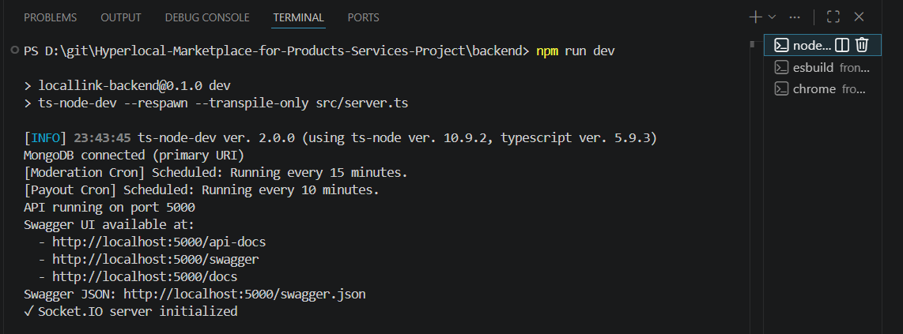

## Playwright Test Files Executed

| Area | Files |
| --- | --- |
| API tests | `tests/api/auth.spec.ts`, `tests/api/category.spec.ts`, `tests/api/product-listings.spec.ts`, `tests/api/product-orders.spec.ts`, `tests/api/service-listings.spec.ts`, `tests/api/service-bookings.spec.ts`, `tests/api/admin-moderation.spec.ts` |
| UI tests | `tests/ui/homepage.spec.ts`, `tests/ui/login.spec.ts`, `tests/ui/admin.spec.ts`, `tests/ui/protected.spec.ts` |

Total implemented Playwright tests identified in the current test files: 26.

## Playwright Result Summary

| Test area | Implemented test count | Current status |
| --- | ---: | --- |
| Auth API | 2 | Passed in latest available Playwright run metadata |
| Categories API | 3 | Passed in latest available Playwright run metadata |
| Product listings API | 4 | Passed in latest available Playwright run metadata |
| Product orders API | 3 | Passed in latest available Playwright run metadata |
| Service listings API | 4 | Passed in latest available Playwright run metadata |
| Service bookings API | 3 | Passed in latest available Playwright run metadata |
| Admin/moderation API | 3 | Passed in latest available Playwright run metadata |
| Basic UI/protected routes | 4 | Passed in latest available Playwright run metadata |
| Total Playwright tests | 26 | Passed in latest available Playwright run metadata |

### Playwright Test Result

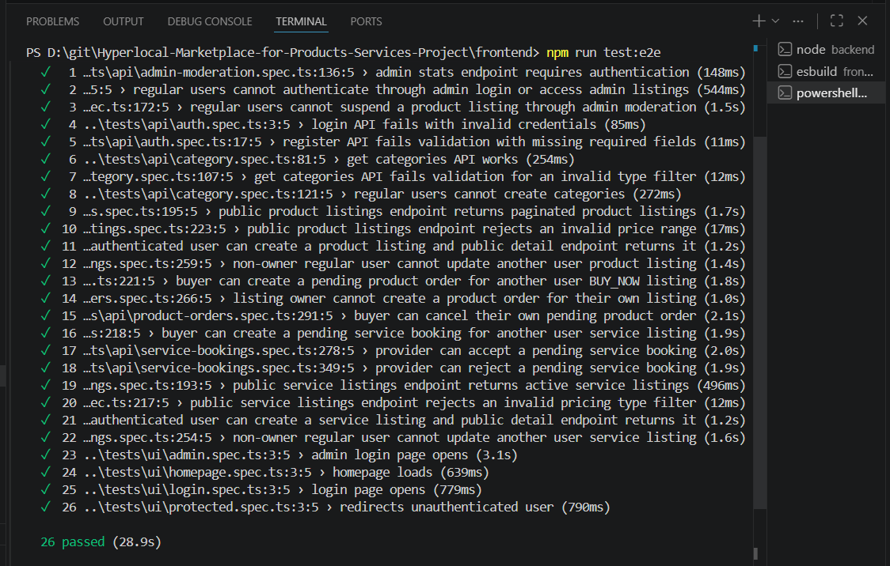

### Playwright HTML Report

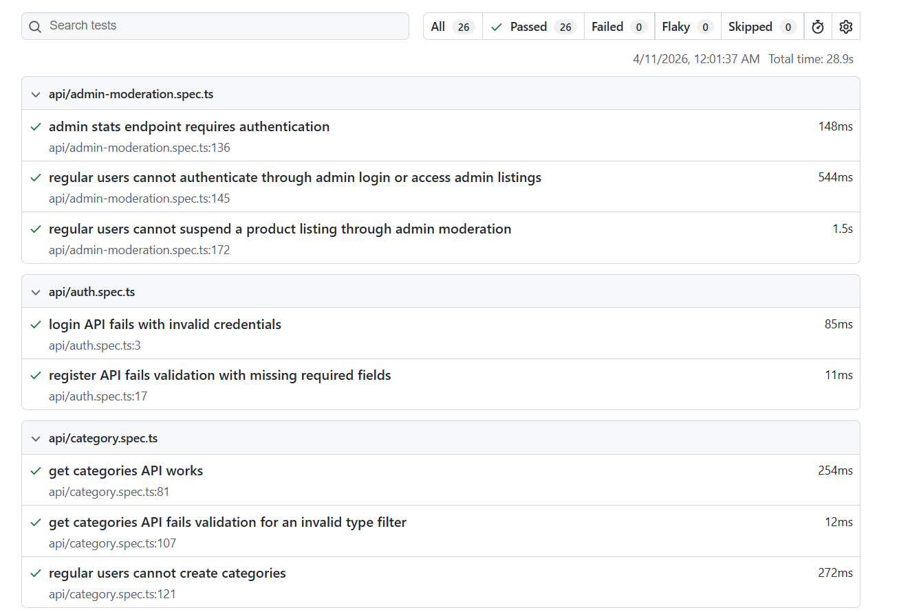

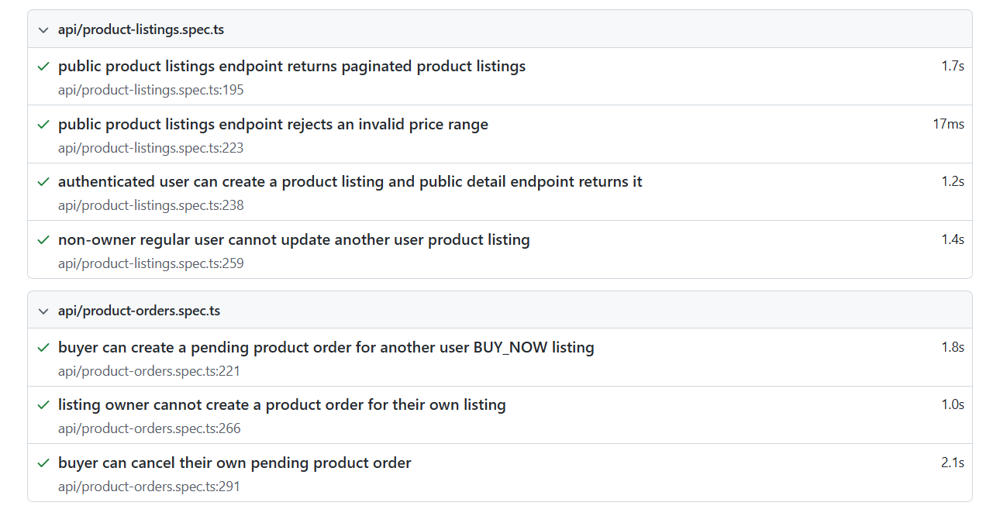

## Backend Unit Test Execution

Backend unit tests are implemented under `backend/tests/unit/` and use Vitest as configured in `backend/package.json`.

Command available from the backend project:

```bash
cd backend
npm run test:unit
```

Equivalent direct commands that match the current folder structure include:

```bash
cd backend
npx vitest run tests/unit/categories tests/unit/product-listings tests/unit/product-orders tests/unit/service-listings
```

The current unit-test modules evidenced in the repository are:

| Module | Implemented unit-test files |
| --- | --- |
| Categories | `backend/tests/unit/categories/categoryController.test.ts`, `backend/tests/unit/categories/categorySchemas.test.ts`, `backend/tests/unit/categories/categoryService.test.ts` |
| Product listings | `backend/tests/unit/product-listings/listingController.test.ts`, `backend/tests/unit/product-listings/listingMiddleware.test.ts`, `backend/tests/unit/product-listings/listingSchemas.test.ts`, `backend/tests/unit/product-listings/listingService.test.ts` |
| Product orders | `backend/tests/unit/product-orders/orderController.test.ts`, `backend/tests/unit/product-orders/orderSchemas.test.ts`, `backend/tests/unit/product-orders/orderService.test.ts` |
| Service listings | `backend/tests/unit/service-listings/serviceSellingMiddleware.test.ts`, `backend/tests/unit/service-listings/serviceSellingSchemas.test.ts`, `backend/tests/unit/service-listings/serviceSellingService.test.ts` |

Unit-test execution screenshots are available for the four backend modules listed above. The screenshots are included here as execution evidence; no additional pass/fail counts are transcribed in this report beyond what is visibly recorded in those images.

### Unit Test Evidence

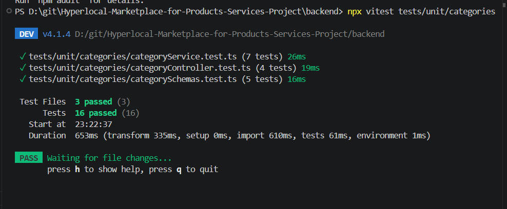

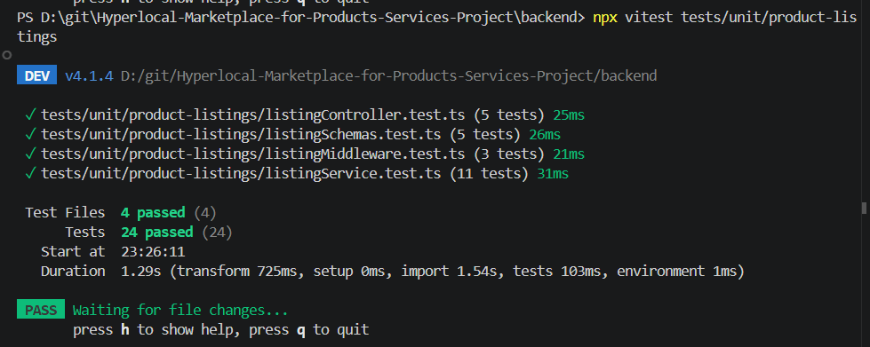

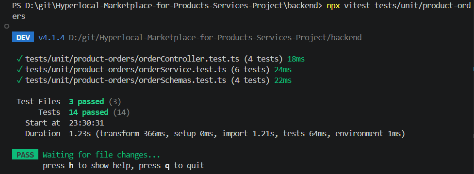

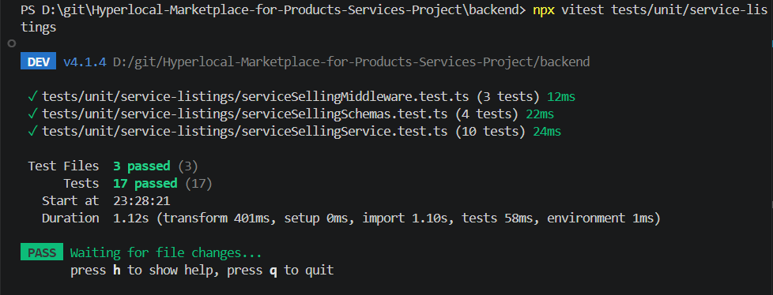

## k6 Performance Test Execution

The current performance test files are:

- `tests/performance/basic-load.js`
- `tests/performance/categories-load.js`
- `tests/performance/product-listings-load.js`
- `tests/performance/service-listings-load.js`
- `tests/performance/product-orders-load.js`

Example commands:

```bash
k6 run tests/performance/basic-load.js
```

```bash
k6 run tests/performance/categories-load.js
```

```bash
k6 run tests/performance/product-listings-load.js
```

```bash
k6 run tests/performance/service-listings-load.js
```

```bash
k6 run tests/performance/product-orders-load.js
```

### Current k6 Script Scope

| Script | Current scope from file |
| --- | --- |
| `tests/performance/basic-load.js` | Basic categories endpoint load check against `/api/categories`. |
| `tests/performance/categories-load.js` | Category listing load check against `/api/categories?isActive=true&page=1&limit=5`. |
| `tests/performance/product-listings-load.js` | Product listing feed load check against `/api/listings?page=1&limit=5`. |
| `tests/performance/service-listings-load.js` | Service listing feed load check against `/api/serviceselling?page=1&limit=5`. |
| `tests/performance/product-orders-load.js` | Product order workflow script that creates test users, creates a `BUY_NOW` listing, creates an order, reads the order during the run, and performs cleanup in teardown. |

### Recorded k6 Result Already Documented in Repository

The repository already documents one k6 run result for `tests/performance/basic-load.js`.

| Metric | Result |
| --- | --- |
| Script | `tests/performance/basic-load.js` |
| Endpoint tested | `/api/categories` |
| Virtual users | 10 |
| Duration | 10s |
| Total requests | 83 |
| Failed requests | 0 |
| Average response time | About 252.83 ms |

This is a basic endpoint load check only. It should not be interpreted as a complete performance benchmark for the full system.

### k6 Load Test Result

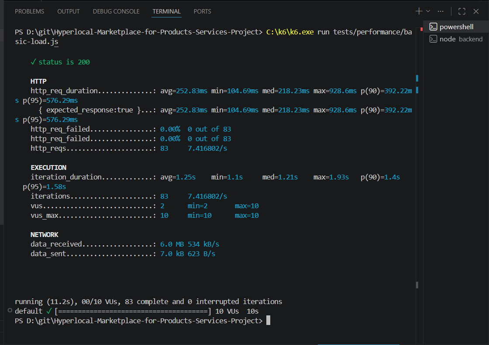

### Additional k6 Screenshot Evidence

The following module-level k6 scripts are present in the repository, and screenshot evidence is now available for them. Numeric summaries are not transcribed here unless already documented in the repository text:

- `tests/performance/categories-load.js`
- `tests/performance/product-listings-load.js`
- `tests/performance/service-listings-load.js`
- `tests/performance/product-orders-load.js`

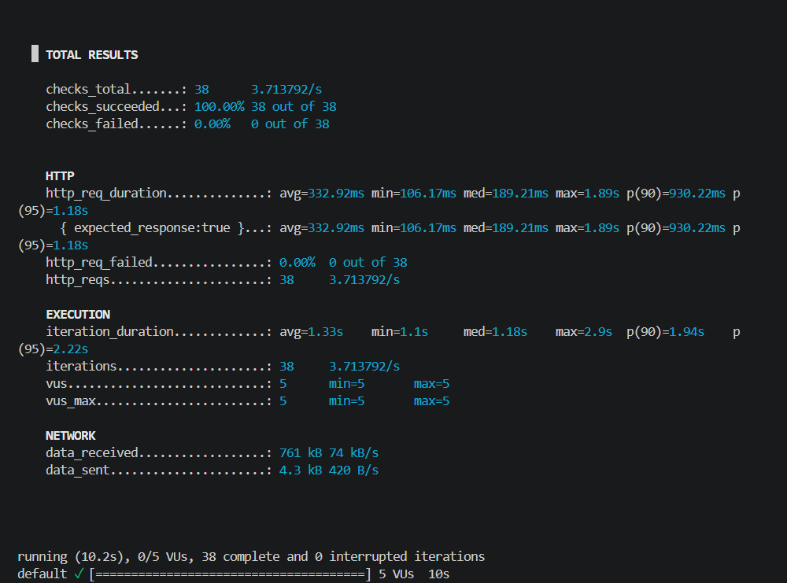

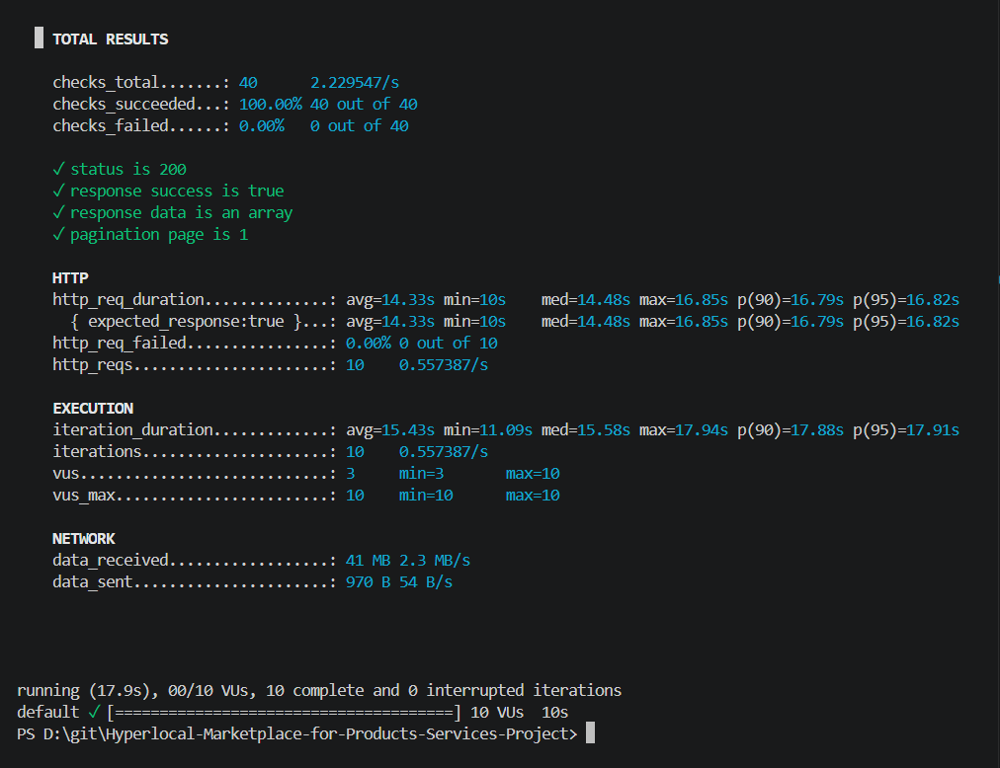

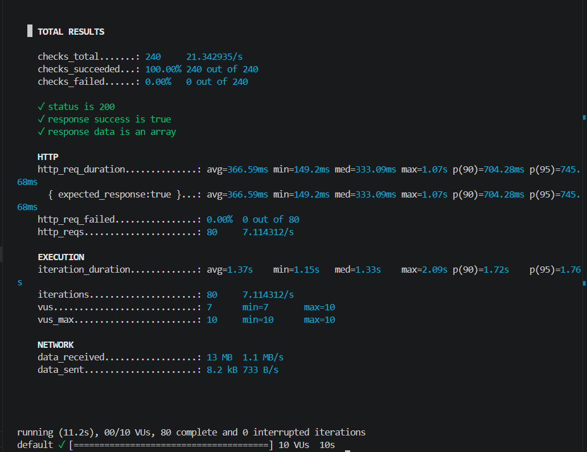

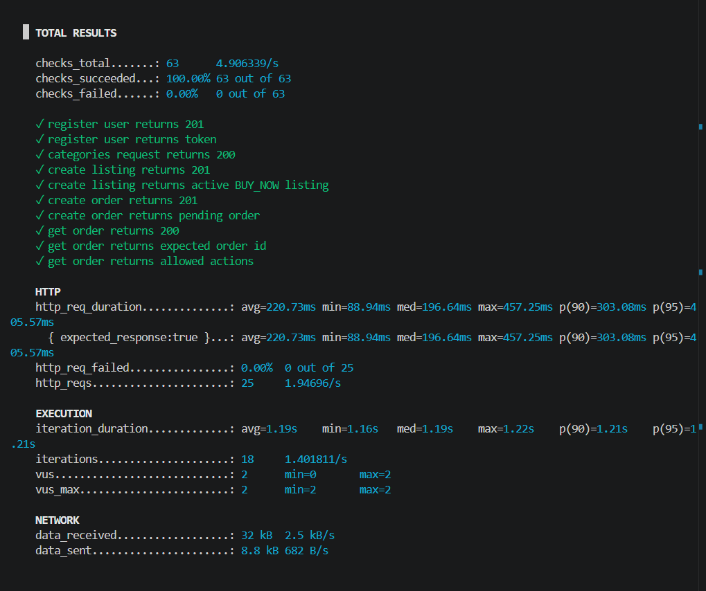

## Swagger/API Documentation Support

Swagger/OpenAPI is present in the backend and can be used for manual inspection and verification of API contracts. It is configured in `backend/src/config/swagger.ts` and mounted in `backend/src/app.ts` at:

- `/api-docs`
- `/swagger`
- `/docs`
- `/swagger.json`

Swagger was treated as API documentation and manual verification support, not as an automated testing tool in the current implemented test set.

## Evidence Notes

The report now references available screenshots for the backend running state, Playwright execution, backend unit-test execution, the basic categories k6 result, and the module-level k6 screenshots currently stored in the repository. Before final submission, confirm that these images match the final local runs you want to submit and replace any older screenshots if newer verified runs are preferred.
